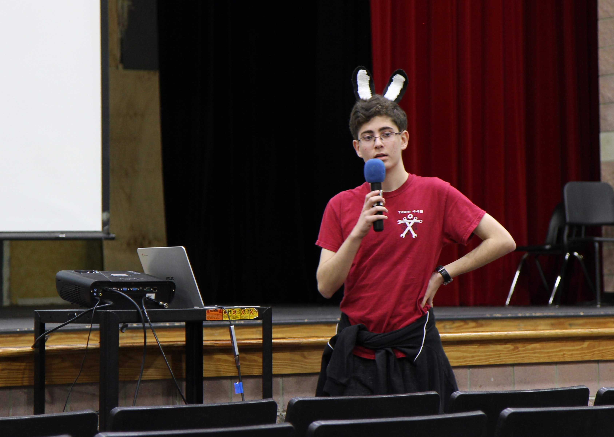

// start off tlaking about the kick off video?!?!??!

**Kickoff** is always one of the best parts of the season. It's a time where we all come together, and a lot of alumni come home to visit. It's a time where all the build up is finally given a result, and where everyone comes together in a whirlwind of conversation, hugs, and confusion.

With the 2019 season, we want to learn from 2018, and do a lot better. Everyone had spent months reflecting on everything that went wrong, and non eof us wanted that to happen again. We took a page out of the books of legendary teams, and began with planning and conversation. But before we all started the cycle of having hour long discussions over one topic, small groups made their own individual decisions. 

Priority lists are always the best place to start. How important are ranking points versus scoring points? Do we need to do Level 3 Climb? Do we need to be able to get high up on the rocket?

And the biggest question: Which one of these tasks would get us through elimination rounds at District events?

We knew that unlike 148 and 254, we shouldn't plan for winning Worlds. Instead, we needed to plan to get farther than we did in 2018, aka, Chespeake District Championships. We already knew who we would be competiting against, the teams that we wanted to be with, and the teams that we wanted to beat. Build season for us isn't just about building, it's also about strategy, about finding out how to be the best we can be and get as far as we can. Designing for world championships isn't strategic for us, but designing for district event eliminations is.

After answering (most) of those questions, archetyping began. 

We stuck to our priority lists and created archetypes based on them. Each group created several archetypes highlighting strengths and weakness of certian strategies. Some groups focused on all levels of hatch, while others focused on level 3 climb. After brainstorming, each team created a presentation on each archetype and created a pro con list. We then estimated point values for each strategy. By evaluating the possibilities in each stage of the competition, we can estimate how many points each strategy can earn for us.

The one strategy we avoided at all costs was jack of all trades. We knew from the start that a robot able to accomplish one task extremely successfully would be much more likely to be selected than a robot that could do many tasks below average. In fact, to ensure that no one even attempted the idea, we create the "Jack of all trades hammer," fashioned out of a large cardboard box and online metals packaging. 

The most important task to accomplish during this process was to create funny names for each archetype, which most groups were relatively successful doing. 

By the end of the day, we all came together and presented our ideas. After each presentation, everyone asked questions about the archetypes. At the end UL chose an archetype.

On Day 2, we focused on Design. We split into groups again and each group was assigned to a certain mechanism. Every group was expected to create a CAD or a simple drawing of their finalized design. Along with mentors, students put out their jdeas of designs. We then finalized details and did math to see if it works. Finally each group created a presentation to discuss the pros and cons of the design and also answered questions about what needed to be done? how many people should work on it? what challenges the design proposes? and what materials does it need.

Finally we come together and present the ideas. After everyone has presented, UL chooses.

