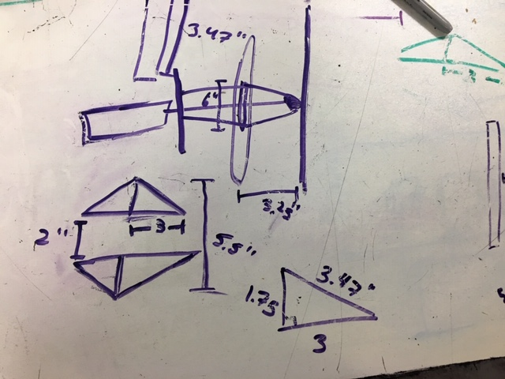
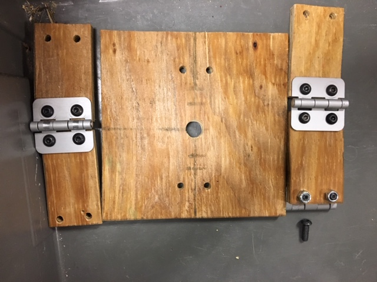

During our first official meeting of the building season... we didn't fully build anything. 

For the majority of the meeting, we worked on designing and starting to machine various mechanisms. Our two hatch groups split off and created preliminary designs for their mechanisms. 

Grab hatch began their suction design, and also began to machine a few of their spacers for their design. However, we discovered that we would not have some of the necessary materials for the mechanism, and the team also began to prototype their other design. They began work on a preliminary velcro device that would secure the hatch and then pull it off of the loading station, using pistons to push the hatch onto the panel's slot. 

Stab hatch worked on finalizing their dimensions and design, and then began to create a prototype out of scrap wood and hinges. 

The drive train team began to reassemble gearboxes, a tedious process that none of us really enjoy, but has to be done. We also began cutting shaft and finding belts and pulleys to create the drive train. We also made an inital CAD, with gussets and wheels, largely based on the drive train from Navi, our 2018 robot. 

Climber, still needing to undergo many design reviews, but began with thinking about the possible designs. The top three options that they found for powering the elevators were either pneumatics, lead screw, or some variation of a belt and pulley system. After thinking about all the possibilities, they decided to move forward with the belt and pulley system, beginning to CAD a first set of reverse elevators, and belt and pulley system. 

Our field elements/electronics team began to work on the loading station and cargo ship, using the wildly confusing instructions thaat FIRST always gives us. 

Our CAD head started to assemble the various parts of the robot together, adding the preliminary suction cup design to the drive train CAD, leaving us at a good stopping point for the meeting. Most of the project leads went home and began CADding their designs, leaving us with a lot to do on the next day. 

