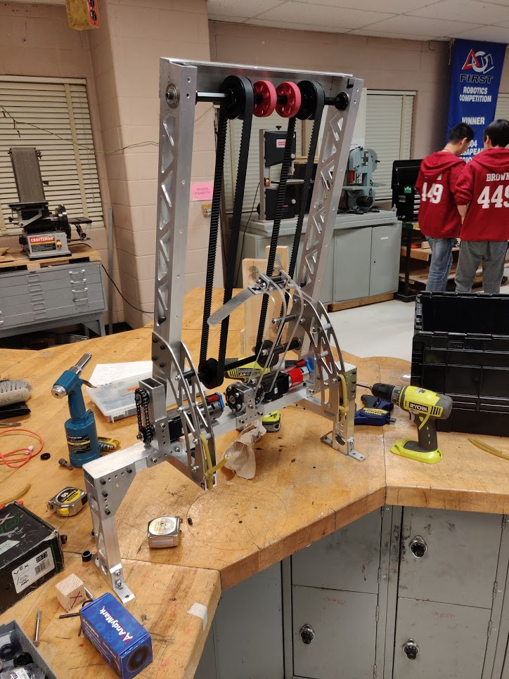

* Did theoretical characterization of legs  
* Had lots of issues
* Finished spraypainting new limelight backboard (hatch mech group is still waiting on new sliders)
* Finished assembling cargo mechanism. Looks good!

===

Since the center of mass of the robot was not half way between the two legs, one leg has to lift more of the robot's weight than the other leg. This means that the legs can't be characterized empirically, since we can't characterize both legs at once, and when we run the characterization on one leg at a time the results aren't representative of the real loads since the robot tilts. However, the legs can be characterized theoretically by calculating what the weight ratio on each one has to be. 

<iframe width="560" height="315" src="https://www.youtube.com/embed/C9ND6cSGJ20" frameborder="0" allow="accelerometer; autoplay; encrypted-media; gyroscope; picture-in-picture" allowfullscreen></iframe>

