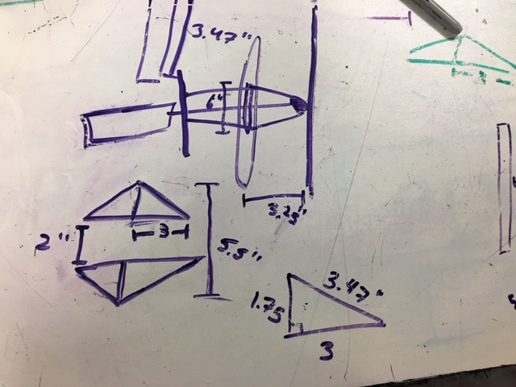
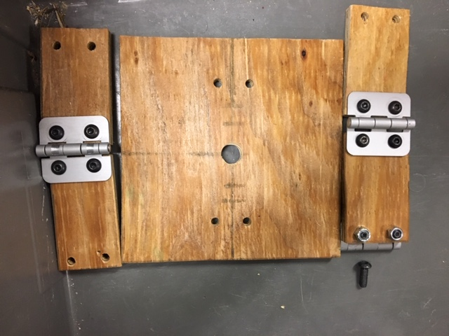

During our first official meeting of the building season... we didn't fully build anything. 

For the majority of the meeting, we worked on designing and starting to machine various mechanisms. Our two hatch groups split off and created preliminary designs for their mechanisms. 

Grab hatch began their suction design, and also began to machine a few of their spacers for their design. However, we discovered that we would not have some of the necessary materials for the mechanism, and the team also began to prototype their other design. They began work on a preliminary velcro device that would secure the hatch and then pull it off of the loading station, using pistons to push the hatch onto the panel's slot. 

Stab hatch worked on finalizing their dimensions and design, and then began to create a prototype out of scrap wood and hinges. 

The drive team reassembled the VexPro 3 CIM Ball Shifter gearboxes that the team used throughout the 2018 season and had formerly disassembled and cleaned. They also worked with the CAD lead to get preliminary dimensions and parameters for the drivetrain, which were fed into the team's drivetrain CAD generator to quickly produce a drivetrain CAD in record speed, ready for fabrication. The frame was set at 31.5" long by 27.5" wide, leaving us with a perimeter 2" smaller than the maximum legal frame perimeter. Since the field was similar to the 2018 field, the team chose to go with the same gearings, wheel size, and wheel configuration that were used in 2018.

Climber, still needing to undergo many design reviews, but began with thinking about the possible designs. The top three options that they found for powering the elevators were either pneumatics, lead screw, or some variation of a belt and pulley system. After considering all the possibilities, they decided to move forward with the belt and pulley system, beginning to CAD a first set of reverse elevators which go downwards rather than upwards and a belt and pulley system. 

Our field elements/electronics team began to work on the loading station and cargo ship, using the wildly confusing instructions thaat FIRST always gives us. 

Our CAD head started to assemble the various parts of the robot together, adding the preliminary suction cup design to the drive train CAD, leaving us at a good stopping point for the meeting. Most of the project leads went home and began CADding their designs, leaving us with a lot to do on the next day. 

