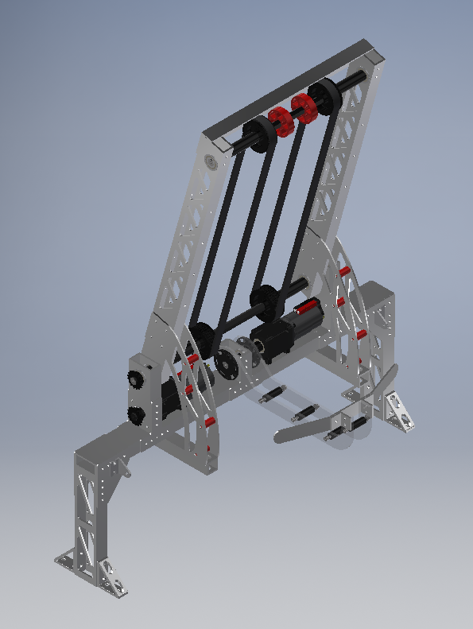

No meeting, early release from school.

Still CADed the cargo mechanism, though!

===

This is the design for the cargo mechanism. One motor powers the belts that move the ball, and another powers the polycarb arm that holds the ball in place. The ball will ride up and down between the belts on the mechanism and the wall of the rocket or the loading station or the cargo ship.

