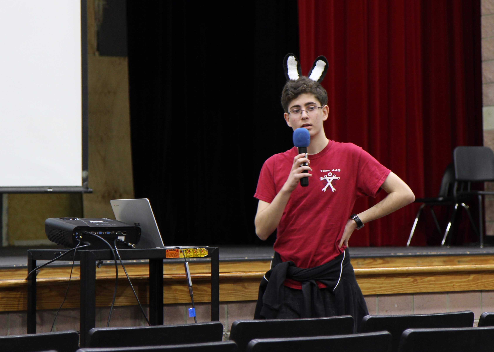
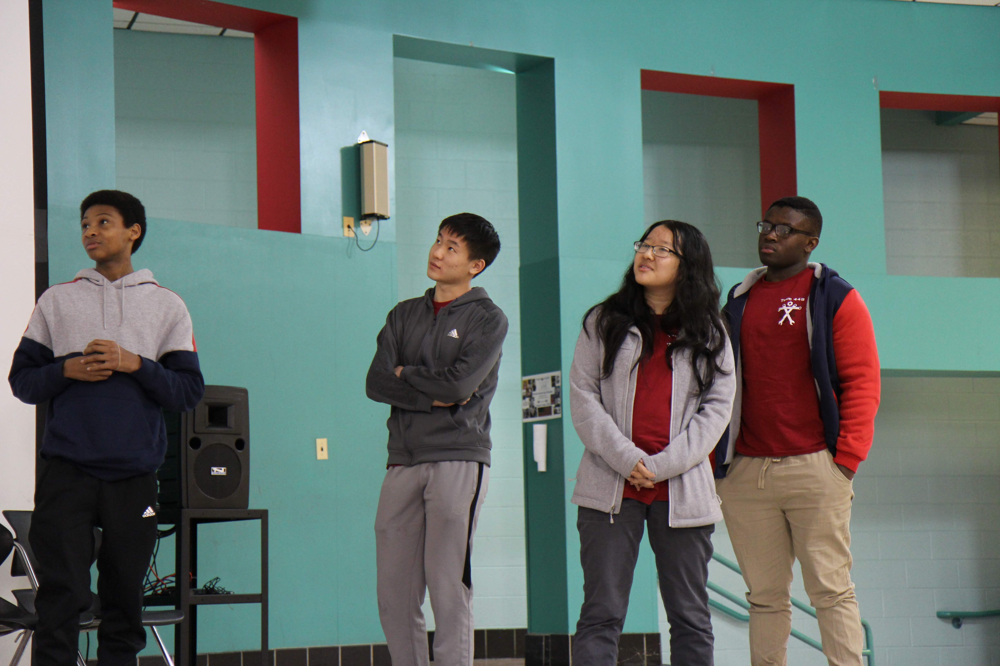
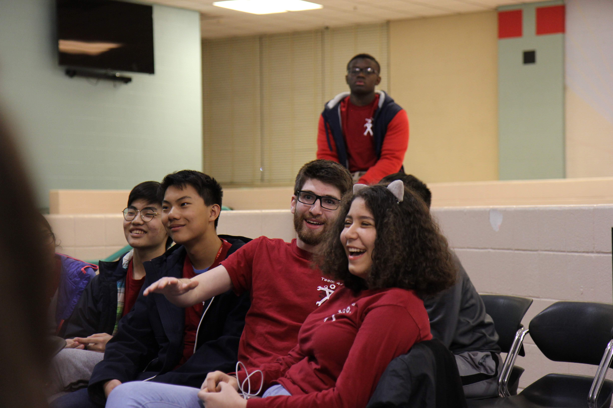
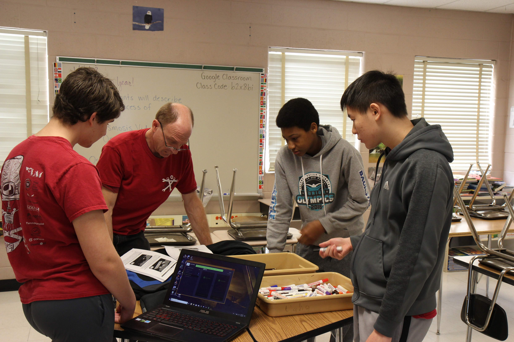
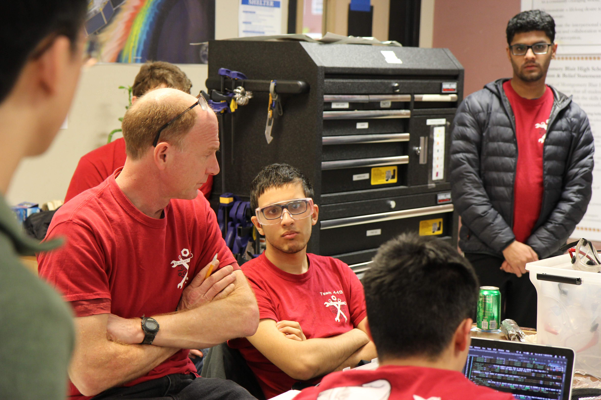
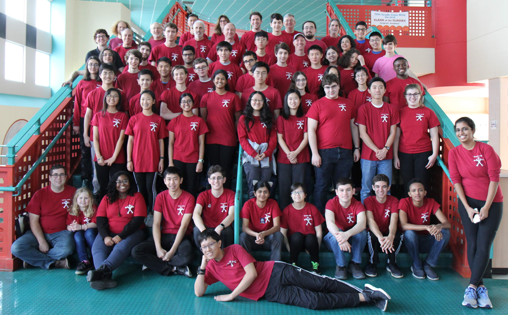

**Kickoff** is always one of the best parts of the season. It's a time where we all come together, and a lot of alumni come home to visit. It's a time where all the build up is finally given a result, and where everyone comes together in a whirlwind of conversation, hugs, and confusion.

With the 2019 season, we want to learn from 2018, and do a lot better. Everyone had spent months reflecting on everything that went wrong, and none of us wanted that to happen again. We took a page out of the books of legendary teams, and began with planning and conversation. But before we all started the cycle of having hour long discussions over one topic, small groups made their own individual decisions. 

Priority lists are always the best place to start. How important are ranking points versus scoring points? Do we need to do Level 3 Climb? Do we need to be able to get high up on the rocket?

And the biggest question: Which one of these tasks would get us through elimination rounds at District events?

We knew that unlike 148 and 254, we shouldn't plan for winning Worlds. Instead, we needed to plan to get farther than we did in 2018, aka, Chespeake District Championships. We already knew who we would be competiting against, the teams that we wanted to be with, and the teams that we wanted to beat. Build season for us isn't just about building, it's also about strategy, about finding out how to be the best we can be and get as far as we can. Designing for world championships isn't strategic for us, but designing for district event eliminations is.

After answering (most) of those questions, archetyping began. 

We stuck to our priority lists and created archetypes based on them. Each group created several archetypes highlighting strengths and weakness of certian strategies. Some groups focused on all levels of hatch, while others focused on level 3 climb. After brainstorming, each team created a presentation on each archetype and created a pro con list. We then estimated point values for each strategy. By evaluating the possibilities in each stage of the competition, we can estimate how many points each strategy can earn for us.

The one strategy we avoided at all costs was jack of all trades. We knew from the start that a robot able to accomplish one task extremely successfully would be much more likely to be selected than a robot that could do many tasks below average. In fact, to ensure that no one even attempted the idea, we create the "Jack of all trades hammer," fashioned out of a large cardboard box and online metals packaging. 

The most important task to accomplish during this process was to create funny names for each archetype, which most groups were relatively successful doing. 

By the end of the day, we all came together and presented our ideas. After each presentation, we took the time to listen to concerns and complaints. By the end of the presentations, we were all ready to have an hour long discussion about team wide priorities. While consolidating people's opinions is a really difficult and usually furstrating to do, we all manage to agree that level one hatch was our first priority. It was already late by the time that conversation was over, and all of us were a little too tired and stressed to agree on anything, so we went home, tired and with a lot on our minds. 

 

On Day 2, we focused on Design. We split into slightly different groups, and each group was assigned a certain mechanism to focus on, ranging from stabby hatch to all level cargo. By the end of the day, every group needed to have a CAD or simple drawing of their preliminary design. Wensen, our VP of Technology, gave us a list of questions that we each had to answer by the end of the day, so we started solving them, one by one. 

Over the day, mentors, students and alumni worked together to shape a mechanism design, along with a preliminary drive train. After a preliminary design, we worked out the details, making sure that the math worked, and other mechanisms could be added. The last step in the preliminary design process was to create a presentation that discussed the pros and cons of the design and answered the questions that Wensen gave us.

During lunch, we did what is arguably the most important part of build season, setting a schedule. Our minimum viable product, or MVP, included field elements and necessary for testing, full manual control of the robot and its mechanisms, and all sensors. It would need to be done by January 20th, whiel the competition robot had a deadline of February 3rd, where the robot would only need code. After the MVP, we would begin the upgrade path, iterating the design until the end of the season, and until we had the best product we could create. All the deadlines were set, only to be adjusted if absolutely necessary. 

At the end of the day, we all came together again, sitting inside of our build room, stress-eating, and discussing. Each group gave their design ideas, and everyone had opinions about what was good and what was bad. Hours of discussion later, all of our technical mentors, along with our president, Noah, and Wensen, moved into our computer lab to finalize the priority list and create the project groups, along with a schedule for the mechanisms. 

The schedule was released onto our team platform, Basecamp, with very little issues, other than a lot of question. We decided that hatch would be our first priority, with two groups running in parallel, one trying to create a mechanisms that would grab the hatch, the other trying to create a mechanism that would stab the hole and take the mechanism from there. 

Our second priority would be cargo, with whichever hatch group was eliminated first being assigned to creating a cargo mechanism, along with the members of the team creating the drive train. The third priority was set as level three climb, and would run from the beginning of the season until it was done, hopefully getting on our robot before competition. 

I hope that we manage to keep to this schedule, and I hope that we get everything done in time. But as our mentors say, man plans and god laughs. 

