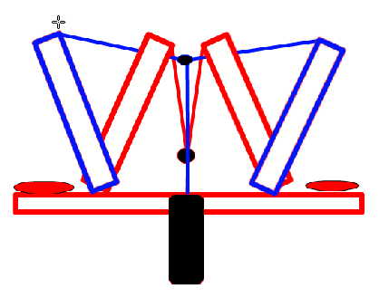
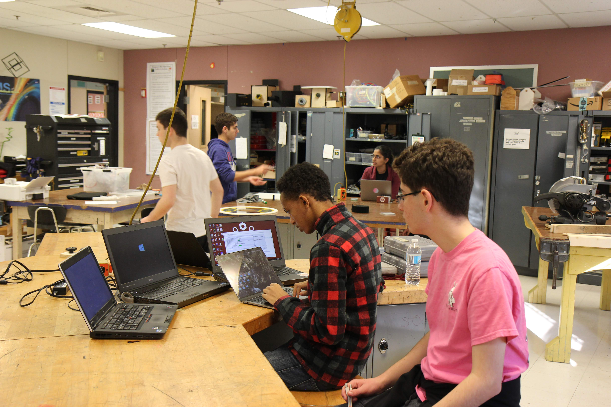

On Tuesday, we continued to prototype, but ran into a very similar problem with stab hatch as we did with grab hatch: lack of materials. However, the project lead didn't give up, and instead pursued other designs, including what he decided to nickname "flower." The mechanism was designed to go into the hole of the hatch and open inside, securing the hatch, and then being delivering on to the cargo ship or rocket with the same mechanism. This design was based on Robot in 3 Days team Ri3D 1.0's hatch mechanism.

Grab hatch team continued with both of their prototypes, designing the suction mechanism and building a full prototype of the velcro and piston mechanism. The project group found that the piston mechanism needed to be fixed because of the lack of power from the piston and the way that the hatch would need to be retrieved. However, the mechanism was found to eject the hatch well and held the hatch extremely securely. 

Speaking of hatches, our field elements team finished making the loading station, and continuted to build the cargo bay. 

Climb team continued to work on their reverse elevators, looking at the potential of [Snow Problem's climber](https://photos.app.goo.gl/iT7hr67wdpntW6xA6), eventually deciding to continue pursuing elevators, along with looking at the mechanism size and continuing the first CAD iteration.

Drive finished assembling gearboxes, even though they had to be taken apart four times and reassembled because everything was being put together wrong. They also got greased, which is objectively the worst part of being on a robotics team, all the grease. It gets everywhere, under nails, on your skin, on your clothes. The rookie team members started to cut shaft lengths for the drive, and the gussets were sanded, even though some of the CNC operation was botched. 

