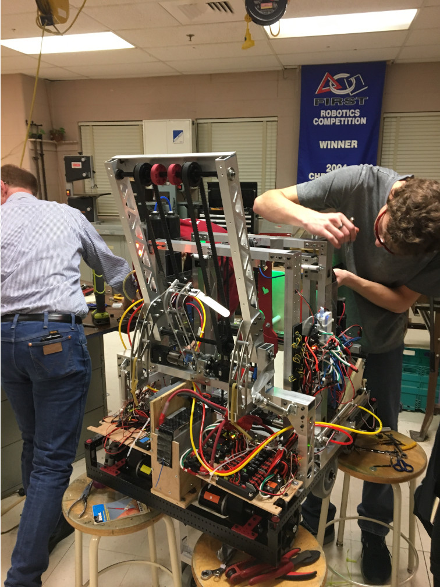
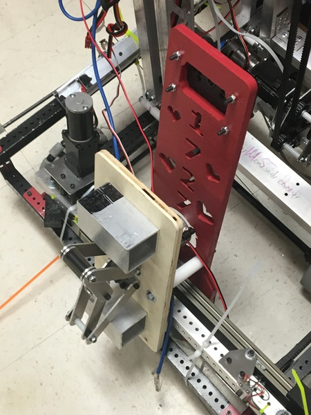

* More leg testing! We are giving up on using characterized velocity PID control and are going to try to use motion profiles instead.
* Started preparing the new linear slides.
* Finished assembling hatch mech with new limelight mount and ziptied it to the robot to estimate the balance for leg testing.
* Mounted the cargo mechanism.
* Weighed the robot at 124 lbs, 14 oz.

===

**Legs**

When we were using velocity PID control, we were essentially trying to tell the legs to move at the same speeds despite them having vastly different loads, which is more difficult than giving each leg a list of positions to be in at different times, which is what a motion profile is. We hope that the motion profiles will help the legs stay more synchronized as they move.

<iframe width="560" height="315" src="https://www.youtube.com/embed/ABnpBGw_6X8" frameborder="0" allow="accelerometer; autoplay; encrypted-media; gyroscope; picture-in-picture" allowfullscreen></iframe>

**Cargo**

Mountings seem pretty solid, but we might want to reconsider the robot-stoppers. They're extra weight and are not necessary if the polycarb claw can take the impact.

**Hatch Mechanism**

We swapped out our limelight mounting so that it is now a single piece and shows our appreciation for an old-time friend.
The new Accuride linear slides we got have a single-piece aluminum rail and a carriage. The carriage comes in a box, but when it is taken out of the box all the ball bearings fall out. After returning the bearings to the carriage, we taped up the edges so the ball bearings would stay in. We started preparing some 1x1 pieces that will mount the slide rails to the superstructure and drilled holes in the rails so they can be mounted. Unfortunately, this 1x1 is too short to mount the pistons onto, so we'll have to make new ones tomorrow. 

